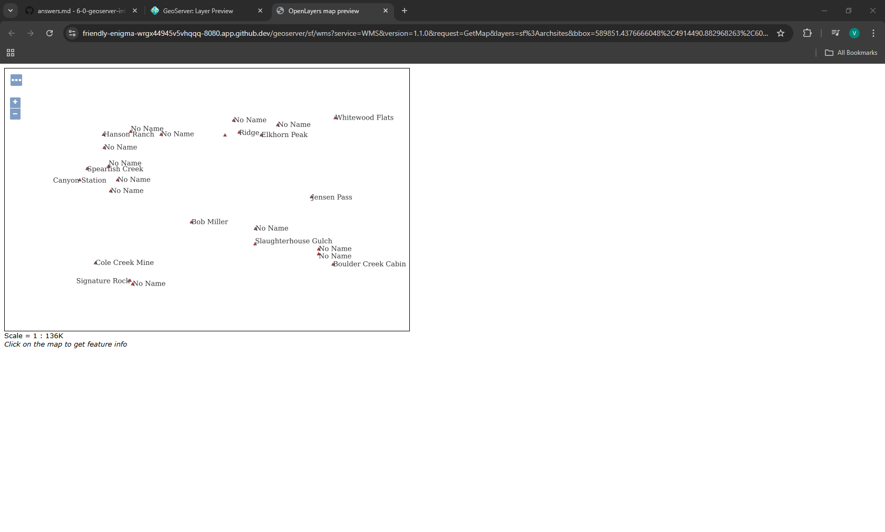
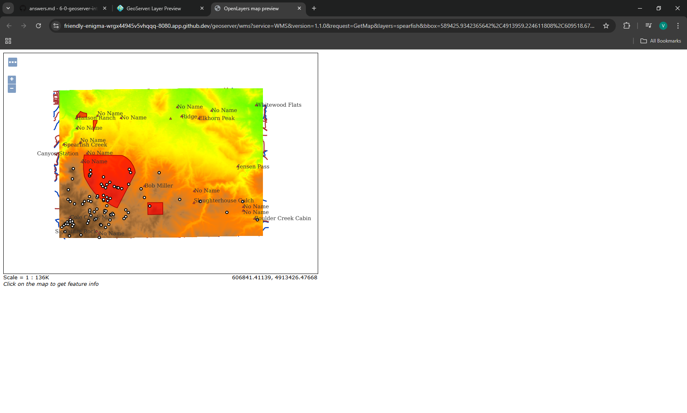

Q1: URL of WMS GetCapabilities request: https://friendly-enigma-wrgx44945v5vhqqq-8080.app.github.dev/geoserver/ows?service=WMS&version=1.3.0&request=GetCapabilities

Q2: URL of WFS GetCapabilities request: https://friendly-enigma-wrgx44945v5vhqqq-8080.app.github.dev/geoserver/ows?service=WFS&acceptversions=2.0.0&request=GetCapabilities

Q3: 

Q4: Drawing order refers to the way the layers are arranged. Opposite from ArcGIS Pro, the first layer in the drawing order will show up underneath all the others. If the DEM is moved from first to third position, it will cover up layers such as the streams layer. Therefore the DEM should stay in first position.

Q5: 

Q6: URL for single-tiled request: https://friendly-enigma-wrgx44945v5vhqqq-8080.app.github.dev/geoserver/wms?SERVICE=WMS&VERSION=1.1.1&REQUEST=GetMap&FORMAT=image%2Fpng&TRANSPARENT=true&STYLES&LAYERS=spearfish&exceptions=application%2Fvnd.ogc.se_inimage&SRS=EPSG%3A26713&WIDTH=1900&HEIGHT=1000&BBOX=587963.5126747%2C4908177.313739625%2C624230.4566113921%2C4927265.178969462

Q7: WMS request for one of the tiled requests: https://friendly-enigma-wrgx44945v5vhqqq-8080.app.github.dev/geoserver/wms?SERVICE=WMS&VERSION=1.1.1&REQUEST=GetMap&FORMAT=image%2Fpng&TRANSPARENT=true&tiled=true&STYLES&LAYERS=spearfish&exceptions=application%2Fvnd.ogc.se_inimage&tilesOrigin=589425.9342365642%2C4913959.224611808&WIDTH=256&HEIGHT=256&SRS=EPSG%3A26713&BBOX=604703.5704812668%2C4919477.329955688%2C605925.1938559765%2C4920698.953330398. The image size is 256 by 256.

Q8: URL of my coarse resolution sample of a WMTS url: https://friendly-enigma-wrgx44945v5vhqqq-8080.app.github.dev/geoserver/gwc/service/wmts?layer=spearfish&style=&tilematrixset=EPSG%3A4326&Service=WMTS&Request=GetTile&Version=1.0.0&Format=image%2Fpng&TileMatrix=EPSG%3A4326%3A12&TileCol=1737&TileRow=1035. This tile refers to the twelveth level (?). Some fields unique to this url are the TileMatrix, TileCol (1737) and TileRow (1035).

Q9: In the zoomed-out URL, the TileCol is 217 and the TileRow is 129.

Q10: In the zoomed-in URL, the TileCol is 13883 and the TileRow is 8295.

Q11: The values are different because they are tile indices that refer to different positions in the tile matrix.

Q12: There is a difference in the TileMatrix (9 vs 15). The number after EPSG:4326 is the number of "levels" the earth has been divided.